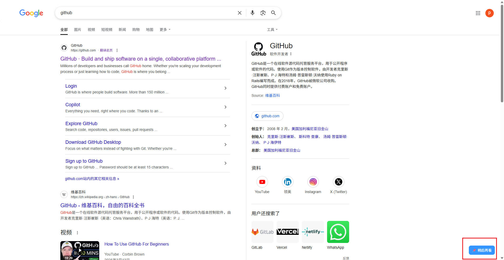

## 🧩 稍后再看 · Chrome 插件

一个极简的「稍后再看」书签管理扩展。支持右键快速保存当前网页、悬浮按钮添加/取消、弹窗查看链接列表，适合碎片阅读场景。

 

------

### 🚀 功能特性

- ✅ 一键保存当前页面至「稍后再看」列表
- ✅ 网页右键菜单：快速添加当前页面
- ✅ 浏览器工具栏点击：自动保存页面
- ✅ 页面右下角悬浮按钮：添加或移除当前页面
- ✅ 弹出窗口查看、打开或删除已保存页面
- ✅ 自动去重、支持页面刷新状态同步

------

### 📦 安装方式（开发者模式）

1. 克隆或下载本项目代码：

```bash
git clone https://github.com/pennxiang/read-later-extension.git
```

1. 打开浏览器地址栏输入：

```
chrome://extensions/
```

1. 开启右上角「开发者模式」
2. 点击「加载已解压的扩展程序」，选择项目目录

------

### 🗂 项目结构说明

```
later-reader/
├── manifest.json           // 插件配置文件
├── background.js           // 后台服务：右键、图标、消息监听等
├── content.js              // 页面注入脚本，生成右下角悬浮按钮
├── saved.html              // 插件弹窗 HTML 页面
├── saved.js                // 弹窗逻辑：列表渲染、删除按钮等
├── style.css               // 样式文件，控制 UI 外观
├── icons/                  // 图标资源（建议48x48）
└── .gitignore              // 忽略 IDEA 缓存和 node_modules
```

------

### 📸 示例图

#### 弹窗展示


#### 网页悬浮按钮



#### 点击后效果


